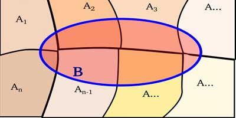

# Probabilidad

## Espacio muestral
**Definición** Sea *E* un experimento no determinístico, entonces $\Omega$ es el conjunto de todos los posibles resultados de *E*.

**Ejemplos:**

1. Experimento: lanzar una moneda
\[
\Omega = \{cara, sello\}
\]
2. Experimento: lanzar un dado
\[
\Omega = \{1,2,3,4,5,6\}
\]
3. Experimento: una rifa
\[
\Omega = \{\textit{númeroos de los boletos vendidos}\}
\]

## Conjunto Potencia o Partes de $\Omega$
\[
\mathscr{P}(\Omega)=2^{\Omega}=\{A\mid A\subseteq \Omega\}
\]

**Ejemplos:**

1. Experimento: lanzar una moneda
\[
\mathscr{P}(\Omega)=2^{\Omega}=\{ \emptyset,\{cara\},\{sello\},\{cara, sello\} \}
\]

\[
Cardinalidad \,\, \mathscr(\mathscr{P}(\Omega))=4
\]

2. Experimento: lanzar un dado
\[
\mathscr{P}(\Omega)=2^{\Omega}=\{ \emptyset,\{1\},\{2\},\{3\}, .... ,\Omega,\emptyset \}
\]

\[
Cardinalidad \,\, \mathscr(\mathscr{P}(\Omega))=64
\]

## Sigma Álgebra

**Definición** Sea $\Omega$ un conjunto fundamental de resultados de un experimento no determinístico específico, entonces,

\[
\mathscr{P}(\Omega) \textit{es una} \,\, sigma - álgebra
\]

que verifica las siguientes propiedades:

1. $\Omega \in \mathscr{P}(\Omega)$
2. $\forall \in \mathscr{P}(\Omega) \Rightarrow A^{c} \in \mathscr{P}(\Omega)$
3. $\forall A_1,A_2, \ldots , A_n \in \mathscr{P}(\Omega) \Rightarrow 
\bigcup A_i \in \mathscr{P}(\Omega)$

**Ejemplo:**

Sea $\mathscr{F}=\{ \Omega, \emptyset \}$ una familia de conjuntos. Probar que esta familia $\mathscr{F}$ es una $\textit{sigma-álgebra}$.

1. Se conoce que $\Omega \in \mathscr{F}$, por tanto, se cumple la primera propiedad.
2. $\Omega \in \mathscr{F} \Rightarrow  \Omega^{c}= \emptyset \in \mathscr{F}$ y $\emptyset \in \mathscr{F} \Rightarrow   \emptyset^{c} = \Omega \in \mathscr{F}$, por tanto, se cumple la segunda propiedad.
3. $\Omega \cup \emptyset = \Omega \in \mathscr{F}$

## Evento

**Definición** Sea $\Omega$ un conjunto fundamental de resultados de un experimento no determinístico determinado y $\mathscr{P}(\Omega)$ un $\textit{sigma-álgebra}$, entonces,
\[
\forall A \in \mathscr{P}(\Omega)
\]
es un Evento.

### Preguntas

| Pregunta       | Respuesta      |
|----------------|----------------|
| ¿Qué es un $\textit{sigma-álgebra}$?               | Familia de subconjuntos de $\Omega$                |
|¿Qué se verifica al tratarse de un $\textit{sigma-álgebra}$?                 |Se verifica las operaciones de conjuntos.                |
|¿Qué es un Evento?                |Cualquier subconjunto de $\Omega$, es un Evento. Es decir, todo subconjunto del conjunto fundamental de resultados, es un Evento                  |

## Álgebra de Eventos

1. $\forall A,B \in \mathscr{P}(\Omega)$, es decir, $A \cup B = \{ x \mid x \in A \vee x \in B\}$
2. $\forall A,B \in \mathscr{P}(\Omega)$, es decir, $A \cap B = \{ x \mid x \in A \wedge x \in B\}$
3. $\forall A,B \in \mathscr{P}(\Omega)$, es decir, $A - B = \{ x \mid x \in A \wedge x \notin B\}$
4. $\forall A \in \mathscr{P}(\Omega)$, es decir, $A^{c} = \{ x \mid x \notin A \wedge x \in \Omega\}$
5. $\forall A,B \in \mathscr{P}(\Omega)$, es decir, $A \triangle B = (A-B) \cup (B-A) \equiv A \triangle B = (A \cup B) - (A \cap B)$
6. $\forall A \in \mathscr{P}(\Omega)$, es decir, $(A \cup B)=A^c \cap B^c$

## Espacio Medible

**Definición** Sea $\Omega$ un conjunto fundamental de resultados de un experimento no terminístico y $\mathscr{P}(\Omega)$, entonces, la dupla
\[
(\Omega, \mathscr{P}(\Omega))
\]
es un Espacio Medible. Donde: $\Omega$ es el Conjunto fundamental de resultados y $\mathscr{P}(\Omega) \,\, \textit{sigma-álgebra}$

## Función de Probabilidad

**Definición** Sea $(\Omega, \mathscr{P}(\Omega))$ un espacio medible, etnonces, la función definida por
\[
\mathbf{P}: \mathscr{P}(\Omega) \rightarrow [0,1]
\]
\[
\,\,\,\,\,\,\,\,\,\,\,\,\,\,\,\,\,\, A \mapsto \mathbf{P}(A)
\]

## Propiedades que cumple la Función de Probabilidad - Axiomas de Kolmogorov

1. $\mathscr{P}(\Omega)=1$, es decir, $\Omega$ evento seguro
2. $\mathscr{P}(\emptyset)=0$, es decir, $\emptyset$ evento imposible
3. $\mathscr{P}(A^c)=1-\mathscr{P}(A)$
4. $\forall A,B \in \mathscr{P}(\Omega)$
\[
\mathbf{P}(A \cup B)=\mathbf{P}(A)+\mathbf{P}(B)
\]
si y solo si, $A$ y $B$ son independientes,
\[
\mathbf{P}(A \cup B)=\mathbf{P}(A)+\mathbf{P}(B)-\mathbf{P}(A \cap B)
\]
si y solo si, $A$ y $B$ no son independientes, o dependientes.

**Ejercicio:**

Sea $A,B \in \mathscr{P}(\Omega)$ donde $A = \emptyset$ y $B \neq \emptyset$. Calcular la probabilidad de $A \cap B$.

Tenemos: 

\[
A \cap B = \emptyset \cap B = \emptyset
\]

finalmente,

\[
\mathbf{P}(A \cap B) = \mathbf{P}(\emptyset) = 0
\]

## Espacio de Probabilidad

**Definición** Sea $(\Omega, \mathscr{P}(\Omega))$ un espacio medible y $\mathbf{P}$ la función de probabilidad definida en este espacio, entonces, la tripleta

\[
(\Omega, \mathscr{P}(\Omega), \mathbf{P})
\]

se le llama, Espacio de Probabilidad.

**Ejemplo:**

- Experimento: lanzar una moneda

\[
\Omega = \{cara, sello \}
\]

\[
\mathscr{P}(\Omega) = \{\Omega, \emptyset, \{cara\}, \{sello\} \}
\]

siendo,

\[
(\Omega, \mathscr{P}(\Omega), \mathbf{P})
\]

un espacio de probabilidad,

\[
\mathbf{P}: \mathscr{P}(\Omega) \rightarrow [0,1]
\]

por Axiomas de Kolmogorov,

\[
\,\,\,\,\,\,\,\,\,\,\,\,\,\,\,\,\,\, \Omega \mapsto \mathbf{P}(\Omega) = 1
\]
\[
\,\,\,\,\,\,\,\,\,\,\,\,\,\,\,\,\,\, \emptyset \mapsto \mathbf{P}(\emptyset) = 0
\]
\[
\,\,\,\,\,\,\,\,\,\,\,\,\,\,\,\,\,\, \{cara\} \mapsto \mathbf{P}(\{cara\}) = \frac{1}{2}
\]
\[
\,\,\,\,\,\,\,\,\,\,\,\,\,\,\,\,\,\, \{sello\} \mapsto \mathbf{P}(\{sello\}) = \frac{1}{2}
\]

## Teorema de Equiprobabilidad

**Definición** Sea $(\Omega, \mathscr{P}(\Omega), \mathbf{P})$ un espacio de probabilidad donde $\Omega = \{x_1,x_2, \dotsc , x_n\}$ y $\mathbf{P}(\{x_1\})=\mathbf{P}(\{x_2\})= \dotsc =\mathbf{P}(\{x_n\})$, entonces,$\forall i = \overline{i,n} \mid \mathbf{P}(\{x_i\}) = \frac{1}{n}$.

$\underline{Demostración:}$

tenemos, $\Omega = \{x_1,x_2, \dotsc , x_n\}, \mathscr{C}(\Omega) = n$ y $\mathscr{P}(\Omega) = \mathscr{P}(\{x_1,x_2, \dotsc , x_n\})$

mediante,
\[
\mathscr{P}(\Omega) = \mathscr{P}(\{x_1,x_2, \dotsc , x_n\}) \equiv 1 = \mathscr{P}(\{x_1\}\cup\{x_2\}\cup  \dotsc \cup \{x_n\})
\]

como, $\{x_1,x_2, \dotsc , x_n\}$ son independientes entre sí,

\[
\mathscr{P}(\Omega) = \mathscr{P}(\{x_1,x_2, \dotsc , x_n\}) \equiv 1 = \mathscr{P}(\{x_1\} + \mathscr{P}(\{x_2\} + \dotsc + \mathscr{P}(\{x_n\}
\]

\[
\mathscr{P}(\Omega) = \mathscr{P}(\{x_1,x_2, \dotsc , x_n\}) \equiv \forall i = \overline{i,n} 1 : n \mathscr{P}(\{x_n\}
\]

\[
\mathscr{P}(\Omega) = \mathscr{P}(\{x_1,x_2, \dotsc , x_n\}) \equiv \mathscr{P}(\{x_i\})=\frac{1}{n}
\]

## Proposición
Sea $(\Omega, \mathscr{P}(\Omega), \mathbf{P})$ un Espacio de Probabilidad, entonces,
\[
\forall A \in \mathscr{P}(\Omega) \mid A=\{x_1,x_2, \ldots, x_k\} \,\textit{y}\,\, \Omega=\{x_1,x_2, \ldots, x_n\}
\]
donde, $k \leq n$, se tiene que
\[
\mathbf{P}(A)=\frac{\mathscr{C}(A)}{\mathscr{C}(\Omega)}=\frac{k}{n}
\]

**Ejercicio:**
Ejemplo: lanzar dos monedas. Calcular, la probabilidad de tener al menos una cara.
$\underline{Tenemos:}$
\[
\Omega=\{(cara, cara)(sello, sello)(cara, sello)(sello, cara)\}
\]
\[
\mathscr{P}(\Omega)=\{\Omega, \emptyset, \{(cara, cara)(sello, cara)\},\{(cara, cara)\}, \ldots\}
\]
\[
\mathscr{C}(\Omega)=2^4=16
\]
$\underline{Ahora}$
\[
A=\{\textit{Obtener al menos una cara}\}
\]
\[
A=\{(cara, cara)(cara, sello)\}
\]
\[
\mathscr{C}(A)=2^2=4
\]
$\underline{Finalmente,}$
\[
\mathbf{P}(A)=\frac{\mathscr{C}(A)}{\mathscr{C}(\Omega)}=\frac{2}{4}=\frac{1}{2}
\]

## Probabilidad Condicional
**Definición** Sea $(\Omega, \mathscr{P}(\Omega), \mathbf{P})$ un Espacio de Probabilidad, entonces, 
\[
\forall A,B \in \mathscr{P}(\Omega): \mathbf{P}(A\mid B)=\frac{\mathbf{P}(A\cap B)}{\mathbf{P}(B)}
\]
donde $\mathbf{P}(B)\neq  0$
\[
\,\, \mathbf{P}(B\mid A)=\frac{\mathbf{P}(A\cap B)}{\mathbf{P}(A)}
\]
donde $\mathbf{P}(A)\neq  0$

*Al tener Probabilidad Condicionada, nos podemos preguntar:* **¿Cuál es la Probabilidad de que exista algo de A en B?**

**Ejercicio:**
Sea $(\Omega, \mathscr{P}(\Omega), \mathbf{P})$ un Espacio de Probabilidad, entonces. Si $A = \emptyset, B\neq \emptyset$. Calcular la probabilidad conjunta de $\mathbf{P}(A\mid B)$ y $\mathbf{P}(B\mid A)$.
\[
\mathbf{P}(A\mid B)=\frac{\mathbf{P}(A\cap B)}{\mathbf{P}(B)}=\frac{\mathbf{P}(\emptyset)}{\mathbf{P}(B)}=0
\]
\[
\mathbf{P}(B\mid A)=\frac{\mathbf{P}(A\cap B)}{\mathbf{P}(A)}=\frac{\mathbf{P}(\emptyset)}{\mathbf{P}(\emptyset)}=\frac{0}{0}= \textbf{Ind.}
\]

## Independiencia de Eventos
**Definición** Sea $(\Omega, \mathscr{P}(\Omega), \mathbf{P})$ un Espacio de Probabilidad. Donde, si $\mathbf{P}(A\cap B)=\mathbf{P}(A)\cdot \mathbf{P}(B)$, entonces, $A$ y $B$ son eventos independientes.

## Probabilidad Total
<div style="text-align:center;">
  
</div>

**Definición** Sea $(\Omega, \mathscr{P}(\Omega), \mathbf{P})$, tal que, $\Omega = \bigcup A_i \,\,$; $\,\forall A_i,A_j: A_i \cap A_j=\emptyset\,\, y\,\, i \neq j$. Probemos, $\mathbf{P}(B)$.
$\underline{Tomemos:}$
\[
\mathbf{P}(B)=\mathbf{P}((B\cap A_1)\cup(B\cap A_2)\cup \cdots \cup (B\cap A_n))
\]
como, sabemos que los eventos $\forall A_i \mid i:\overline{i,n}$ son independientes,
\[
\mathbf{P}(B)=\mathbf{P}(B\cap A_1)+\mathbf{P}(B\cap A_2)+ \cdots + \mathbf{P}(B\cap A_n)
\]
tengamos en cuenta lo siguiente,
\[
\mathbf{P}(B\mid A_1)=\frac{\mathbf{P}(B\cap A_1)}{\mathbf{P}(A_1)}
\]

\[
\mathbf{P}(B\mid A_2)=\frac{\mathbf{P}(B\cap A_2)}{\mathbf{P}(A_2)}
\]

\[
\vdots
\]

\[
\mathbf{P}(B\mid A_n)=\frac{\mathbf{P}(B\cap A_n)}{\mathbf{P}(A_n)}
\]
por tanto,
\[
\mathbf{P}(B)=\mathbf{P}(B\mid A_1)\cdot \mathbf{P}(A_1)+\mathbf{P}(B\mid A_2) \cdot \mathbf{P}(A_2)+ \cdots +\mathbf{P}(B\mid A_n)\cdot \mathbf{P} (A_n)
\]
Finalmente,
\[
\mathbf{P}(B)=\sum_{i=1}^{n}{\mathbf{P}(B\mid A_i) \cdot \mathbf{P}(A_i)}
\]

**Ejemplo:**
Experimento, al azar un estudiante de séptimo semestre paralelo 1. Calcular la Probabilidad de que es estudiante viva en el Sur de la ciudad. Sabemos que, estudiantes hombres son 7 y mujeres 8. Además, sabemos que el númeroo de hombres que vive en el Sur es de 3 y el númeroo de muejeres que vive en el Sur es 2. Consideremos el Evento $B=\{\textit{Estudiante que vive en el Sur de la ciudad}\}$.

$\underline{Tenemos:}$

\[
\mathbf{P}=\sum_{i=1}^{2}{\mathbf{P}(B \mid A_i)\cdot \mathbf{P}(A_i)}
\]
es decir,
\[
\mathbf{P}=\mathbf{P}(B \mid H)\cdot \mathbf{P}(H)+\mathbf{P}(B \mid M)\cdot \mathbf{P}(M)
\]
recordemos que, $\mathbf{P}(B \mid H)$ es la probabilidad del Evento B dado que sea hombre, sino también, la probabilidad de que exista una persona que viva en el Sur y este debe ser hombre. 
\[
\mathbf{P}=\frac{3}{7}\cdot \frac{7}{15}+\frac{2}{8}\cdot \frac{8}{15}
\]

\[
\mathbf{P}=\frac{1}{3}
\]
por tanto, hay $\frac{1}{3}$ de probabilidad, que al seleccionar de forma aleatoria un estudiante este viva en el Sur y sea hombre.

### Teorema de Bayes
Usemos la gráfica anterior.

<div style="text-align:center;">
  
</div>

Ahora, para conocer a Bayes. Se nos pide hallar $\mathbf{P}(A_j\mid B)$ donde $i \neq j$. Y recordemos que los Eventos son independientes.

$\underline{\textit{Samemos que:}}$
\[
\mathbf{P}(A_j\mid B)=\frac{\mathbf{P}(A_{j}\,\cap B)}{\mathbf{P}(B)}
\]
y de Probabilidad Total, tenemos
\[
\mathbf{P}(A_j\mid B)=\frac{\mathbf{P}(A_{j}\cap B)}{\sum_{i=1}^{n}{\mathbf{P}(B \mid A_i)\cdot \mathbf{P}(A_i)}}
\]
finalmente, junto a $\mathbf{P}(B\mid A_j)=\frac{\mathbf{P}(A_{j}\,\cap B)}{\mathbf{P}(A_j)}$
\[
\mathbf{P}(A_j\mid B)=\frac{\mathbf{P}(B\mid A_j)\cdot \mathbf{P}(A_j) }{\sum_{i=1}^{n}{\mathbf{P}(B \mid A_i)\cdot \mathbf{P}(A_i)}}
\]

**Experimento:** Calcular la probabilidad de que al azar se obtenga a una estudiante que viva en el Sur de la ciudad. Recordemos el ejercicio anterior, $B=\{\textit{Estudiante que vive en el Sur de la ciudad}\}$.

\[
\mathbf{P}(M\mid B)=\frac{\mathbf{P}(M\,\cap B)}{\mathbf{P}(B)}
\]

\[
\mathbf{P}(M\mid B)=\frac{\mathbf{P}(M\mid B)\cdot \mathbf{P}(M)}{\mathbf{P}(B)}
\]

\[
\mathbf{P}(M\mid B)=\frac{\frac{2}{8}\cdot\frac{8}{15}}{\frac{1}{3}}
\]

\[
\mathbf{P}(M\mid B)=\frac{2}{5}
\]

## Variables Aleatorias
**Definición** Sea $(\Omega, \mathscr{P}(\Omega), \mathbf{P})$ un Espacio de Probabilidad, entonces, la función definida por:
\[
X: \Omega \rightarrow \mathbb{R}_x \subseteq \mathbb{R}
\]
\[
\,\,\,\,\,\,\,\,\,\,\,\,\,\,\,\,\,\, \omega \mapsto X(\omega)
\]
es una Variable Aleatoria.  
**Ejemplo**  \
Experimento: lanzar dos monedas  \
$\underline{Tenemos:}$  \
\[
\Omega=\{(cara, cara)(sello, sello)(cara, sello)(sello, cara)\}
\]
\[
X: \textit{Mide el númeroo de caras}
\]
recordemos que $X$, tiene una naturaleza, es lo que indica su variable: edad, peso, etc.
\[
X: \Omega \rightarrow \mathbb{R}_x \subseteq \mathbb{R}
\]
\[
\,\,\,\,\,\,\,\,\,\,\,\,\,\,\,\,\,\, (cara, cara) \mapsto X((cara, cara)) = 2
\]
\[
\,\,\,\,\,\,\,\,\,\,\,\,\,\,\,\,\,\, (cara, sello) \mapsto X((cara, sello)) = 1
\]
\[
\,\,\,\,\,\,\,\,\,\,\,\,\,\,\,\,\,\, (sello, cara) \mapsto X((sello, cara)) = 1
\]
\[
\,\,\,\,\,\,\,\,\,\,\,\,\,\,\,\,\,\, (sello, sello) \mapsto X((sello, sello)) = 0
\]

## Ley de Probabilidades de una Variable Aleatoria
**Definición** Sea $(\Omega, \mathscr{P}(\Omega), \mathbf{P})$ un Espacio de Probabilidad y $X$ una Variable Aleatoria definida en este espacio, entonces, la función definida por
\[
f: \mathbb{R}_x \rightarrow [0, 1]
\]
\[
\,\,\,\,\,\,\,\,\,\,\,\,\,\,\,\,\,\, x \mapsto f(x)
\]
se le conoce como la Ley de Probabilidad de la Variable Aleatoria $X$.

### Tipos de Variables Aleatorias

**Variable Aleatoria Discreta:** Si $\mathbb{R}_x$ es un conjunto finito o infinito NUMERABLE. \
**Variable Aleatoria Continua:** Si $\mathbb{R}_x$ es un conjunto finito o infinito NO NUMERABLE.

## Propiedades de las Variables Aleatorias
Si $X$ es una *Variable Aleatoria Discreta*,

+ $\sum_{i=1}^{n}{f(x_i)=1}$
+ $0\leq  f(x_i) \leq 1$

Si $X$ es una *Variable Aleatoria Continua*,

+ $\int_{- \infty}^{\infty}{f(x)\, dx=1}$
+ $0\leq  f(x) \leq 1$

$\underline{\textit{Caso Discreto}}$ \
**Ejemplo**  \
Experimento: lanzar dos monedas  \
$\underline{Tenemos:}$  \
\[
\Omega=\{(cara, cara)(sello, sello)(cara, sello)(sello, cara)\}
\]
\[
X: \textit{Mide el número de caras}
\]

| $\Omega$       | $X$      | Ley de Probabilidades      |
|----------------|----------------|----------------|
| $(cara, cara)$| 2               |$\mathbf{P}(X=0)=\frac{1}{4}$ |
| $(sello, cara)$| 1               |$\mathbf{P}(X=1)=\frac{1}{4}$ |
| $(cara, sello)$| 1               |$\mathbf{P}(X=1)=\frac{1}{4}$ |
| $(sello, sello)$| 0               |$\mathbf{P}(X=2)=\frac{1}{4}$ |

```{r Gráfica - Ley de Probabilidades}
# Generando los valores
x <- c(0, 1, 2)
y <- c(1/4,1/2,1/4)

# Generando la gráfica
plot(x, y, main = " Representación Ley de Probabilidades",
     xlab = "Valores - Conjunto Fundamental de Resultados dado X",
     ylab = "Probabilidad",
     type = "b", col = "black")
abline(h = 0.5, lty = 3, col = "blue")

```

$\underline{\textit{Caso Continuo}}$ \
**Ejemplo**  \
Sea $X$ una Variable Aleatoria Continua con la Ley de Probabilidad definida por,
\[
f(x)= \begin{cases} 
      \frac{1}{b-a} & \text{si } x \in [a, b] \\
      0 & \text{caso contrario } 
   \end{cases}
\]
Probar que $f(x)$ es una Ley de Probabilidades. Para ello, basta con probar sus características.
$\textit{Probemos entonces}$
\[
\int_{-\infty}^{\infty}f(x) dx = 1
\]
por tanto,
\[
\int_{-\infty}^{\infty}f(x) dx = \int_{-\infty}^{a}f(x) dx+\int_{a}^{b}f(x) dx+\int_{b}^{\infty}f(x) dx
\]
conocemos, por su definición que $\int_{-\infty}^{a}f(x) dx$ y $\int_{b}^{\infty}f(x) dx$ son cero, entonces,
\[
\int_{-\infty}^{\infty}f(x) dx = \int_{a}^{b} \frac{1}{b-a} dx
\]
\[
\int_{-\infty}^{\infty}f(x) dx = \frac{1}{b-a} \cdot x \bigg|_{a}^{b}
\]
\[
\int_{-\infty}^{\infty}f(x) dx = \frac{b-a}{b-a} 
\]
\[
\int_{-\infty}^{\infty}f(x) dx = 1
\]

## Varianza de la Variable Aleatoria X
**Definición** Sea $(\Omega, \mathscr{P}(\Omega), \mathbf{P})$ un espacio de probabilidad, entonces, la varianza de una variable aleatoria $X$, está dada por
\[
V(X)=E(X-E(X))^2
\]

### Propiedades de la Varianza Aleatoria de X
Sea $X, Y$ variables aleatorias y $k \in \mathbb{R}$ una constante,

1. $V(k\cdot X)=k^2\cdot V(X)$
2. $V(X+Y)=V(X)+V(Y)+cov(X,Y)$, si $X, Y$ son dependientes
$V(X+Y)=V(X)+V(Y)$, si $X, Y$ son independientes
3. $V(X)=E(X^2)-E^2(X)$

$\textit{Caso Discreto}$ \
**Ejemplo**  \
Experimento: lanzar dos monedas \
$\underline{Tenemos:}$
\[
\Omega=\{(cara, cara)(sello, sello)(cara, sello)(sello, cara)\}
\]
$X:$ indica el número de caras

| $\Omega$       | $X$| $f(x)$|$F(x)$|$E(X)$|$E(X^2)$|
|----------------|----------------|----------------|----------------|----------------|----------------|
| $(sello, sello)$|0| $\frac{1}{4}$|$\frac{1}{4}$|$0$|$0^2 \cdot \frac{1}{4}$|
| $(cara, sello), (sello, cara)$|1| $\frac{1}{4}$|$\frac{3}{4}$|$\frac{2}{4}$|$1^2\cdot \frac{2}{4}$|
| $(cara, cara)$|2| $\frac{1}{4}$|$1$|$\frac{2}{4}$|$2^2\cdot \frac{1}{4}$|
luego,
\[
V(X)=E(X^2)-E^2(X)
\]
\[
V(X)=\frac{3}{2}-1=\frac{1}{2}
\]

$\textit{Caso Continuo}$ \
Sea una Variable Aleatoria Continua una función densidad,
\[
f(x)= \begin{cases} 
      \frac{1}{b-a} & \text{si } x \in [a, b] \\
      0 & \text{caso contrario } 
   \end{cases}
\]
Calcular la $V(X)$. \
Por ejercicios anteriores, sabemos que $E(X)=\frac{b+a}{2}\,\,\, (1)$ \
luego,
\[
E(X^2)=\int_{-\infty}^{\infty}{x^2f(x)dx}=\int_{a}^{b}{x^2\cdot \left(\frac{1}{b-a}\right)dx}
\]
\[
E(X^2)=\frac{1}{3(b-a)}x^3 \bigg|_a^b=\frac{b^2+ab+a^2}{3}
\]
de lo anterior y junto con $(1)$
\[
E(X)=\frac{b^2+ab+a^2}{3}-\left(\frac{b+a}{2} \right)^2
\]
finalmente,
\[
E(X)=\frac{(b-a)^2}{12}
\]

## Principales Distribuciones de Probabilidad con Variable Aleatoria Discreta
### Distribución de Bernoulli
\[
X \sim \textit{Bernoulli}(\mathcal{p})
\]
cuando:

+ $X:$ indica el éxito
+ $\mathcal{p}=\mathbf{P}(éxito)$
+ $1-\mathcal{p}= \mathbf{P}(fracaso)=\mathcal{q}$

| $\Omega$       | $X$| $f(x)$|$F(x)$|$E(X)$|$E(X^2)$|
|----------------|----------------|----------------|----------------|----------------|----------------|
| Fracaso|0| $\mathbf{P}(X=0)=\mathcal{q}$|$\mathcal{q}$|$0 \cdot \mathcal{q}$|$0^2 \cdot \mathcal{q}$|
| Éxito|1| $\mathbf{P}(X=1)=\mathcal{p}$|$\mathcal{p}+ \mathcal{q}$|$1 \cdot \mathcal{p}$|$1^2 \cdot \mathcal{p}$|

$E(X)=\mathcal{p}$ \
$V(X)=\mathcal{p}\cdot \mathcal{q}$

# Métodos de Estimación de Parámetros
Respondemos a la pregunta la variable aleatoria $X$, ¿cuáles son los parámetros dada una distribución de probabilidades?. Por ejemplo, conocemos que $X \sim N(\mu, \delta)$, nuestro trabajo consistirá encontrar a qué equivalen esos parámetros.  \

Se lo hará mediante el muestreo, es decir,
$\textit{Estimar } \rightarrow \hat{\theta} = f(x_1,x_2, \dotsc, x_n)$

## Estimador o Estadístico


# Ecuacionario
## Distribución de Bernoulli
\[
X \sim \textit{Bernoulli}(\mathcal{p})
\]
cuando: 

+ $X:$ indica el éxito
+ $\mathcal{p}=\mathbf{P}(éxito)$
+ $1-\mathcal{p}= \mathbf{P}(fracaso)=\mathcal{q}$

\[E(X)=\mathcal{p}\]
\[V(X)=\mathcal{p}\cdot \mathcal{q}\]


